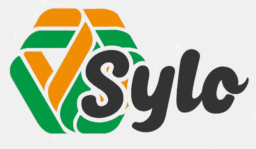

[](https://nodejs.org/)
[](https://reactjs.org/)

Welcome to the Sylo Website repository! This repository contains the source code for the Sylo website, built using Node.js and React.

## Getting Started

### Prerequisites

- Node.js (^14.0.0)
- npm or yarn

### Installation

1. Clone the repository:

    ```bash
    git clone https://github.com/sylo/website.git
    ```

2. Navigate into the project directory:

    ```bash
    cd website
    ```

3. Install dependencies:

    Using npm:

    ```bash
    npm install
    ```

    Or using yarn:

    ```bash
    yarn install
    ```

### Running Locally

Once you have installed the dependencies, you can run the Sylo website locally by executing:

Using npm:

```bash
npm start
